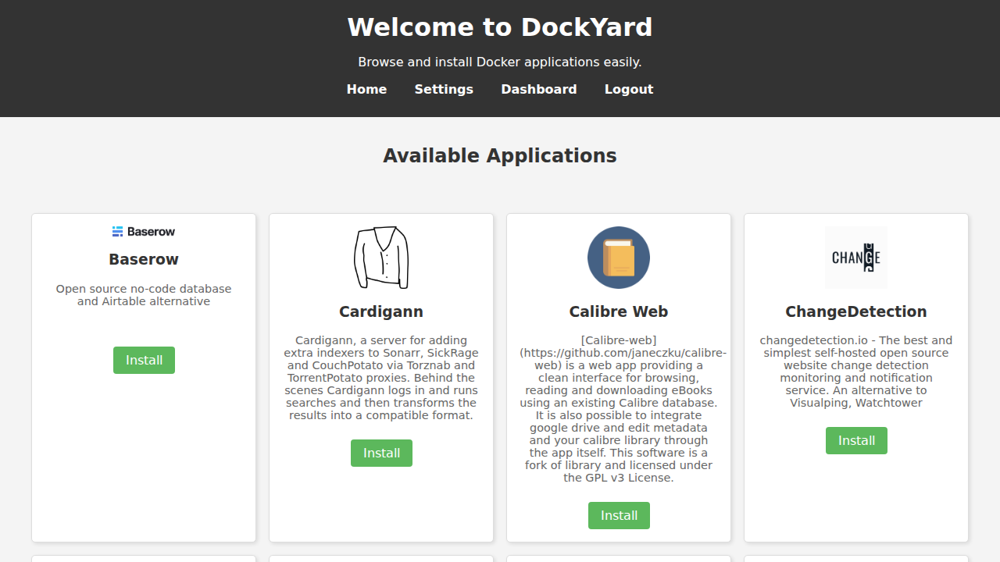
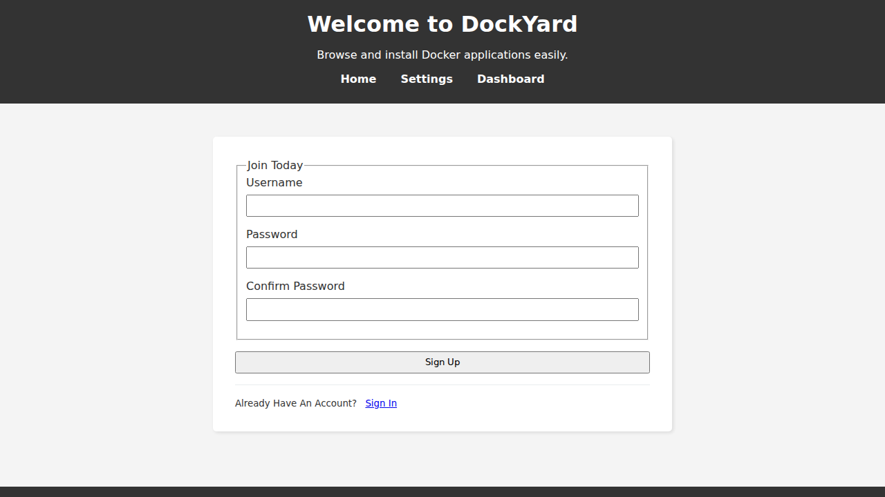
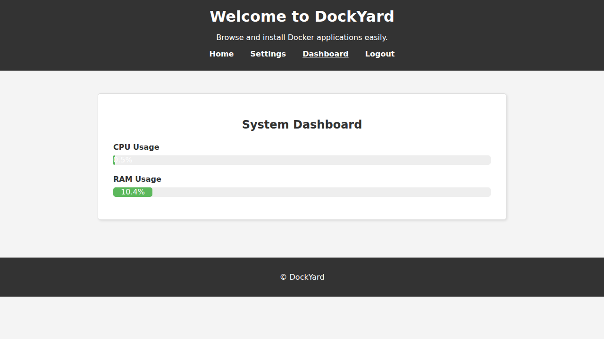
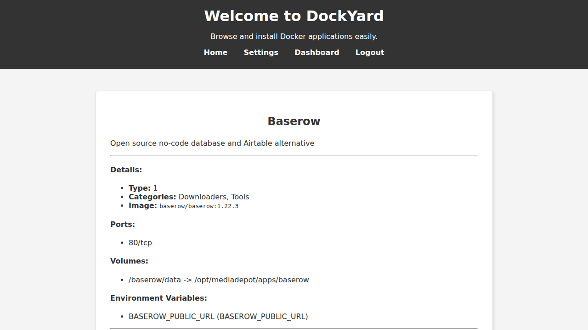

# DockYard - Your Docker Application Facilitator

DockYard is a simple, self-hosted web application that helps you discover and install Docker applications from predefined template lists. It's designed to be a lightweight alternative or companion to tools like Portainer for quick deployments.



## Features

DockYard comes with a range of features designed to make managing your Docker applications as simple as possible.

*   **User Authentication:** Secure access with a simple login system. On the first launch, you'll be prompted to create an admin account.
    

*   **System Dashboard:** A dedicated dashboard provides a real-time overview of your system's health, including CPU and RAM usage.
    

*   **Browse and Install Applications:** Easily browse Docker applications from multiple template sources.
*   **Detailed Application View:** Click on any application to see a detailed view with information about its image, ports, volumes, and environment variables.
    

*   **Template Selection:** If an application is available from multiple sources, DockYard allows you to choose which template you'd like to install.
*   **Configurable and Persistent:** Template sources can be configured through the UI, and your settings are persisted across container restarts using a Docker volume.
*   **Periodic Updates:** DockYard periodically fetches the latest templates in the background to ensure your application list is always up-to-date.

## Getting Started

This guide will help you get DockYard up and running on your system using Docker Compose.

### Prerequisites

*   A system with `docker` and `docker-compose` installed. For instructions on installing Docker, see the [official Docker documentation](https://docs.docker.com/engine/install/).

### Installation

1.  **Clone the Repository**
    Clone this repository to your local machine:
    ```bash
    git clone https://github.com/Jailtonfonseca/docker-images.git
    cd docker-images
    ```

2.  **Configure the Application**
    The `docker-compose.yml` file is the primary way to configure DockYard. Before you start the application, you **must** edit this file to set a secure `SECRET_KEY`.

    Open `docker-compose.yml` and replace `YOUR_UNIQUE_STRONG_SECRET_KEY_HERE` with a long, random string. You also need to add your `GOOGLE_API_KEY`:
    ```yaml
    # ...
    environment:
      - SECRET_KEY=YOUR_UNIQUE_STRONG_SECRET_KEY_HERE
      - GOOGLE_API_KEY=YOUR_GOOGLE_API_KEY
    # ...
    ```
    You can also change the default `TEMPLATE_SOURCES_URL` in this file if you wish.

3.  **Run the Application**
    With the configuration in place, you can start the application using Docker Compose:
    ```bash
    sudo docker-compose up -d
    ```
    This command will build the DockYard image and start the container in the background.

### First Run: Creating an Account

On the very first run, you will need to create an admin account.

1.  Navigate to `http://localhost:5001` in your web browser.
2.  You will be automatically redirected to the registration page.
3.  Fill in your desired username and a strong password to create your account.

After registering, you will be redirected to the login page. All subsequent visits to the application will require you to log in.

## How It Works

DockYard is built with a modern and robust stack:

*   **Backend:** A Flask web application (Python).
*   **Authentication:** `Flask-Login` for session management and `Flask-Bcrypt` for secure password hashing.
*   **System Metrics:** The `psutil` library is used to gather system information for the dashboard.
*   **Template Management:** A custom `template_manager.py` fetches, parses, and caches JSON template files.
*   **Configuration:** A `config_manager.py` handles the persistence of user-defined settings.
*   **Docker Interaction:** A `docker_manager.py` interacts with the Docker daemon to install containers.
*   **Scheduled Tasks:** An `APScheduler` instance handles the periodic background updates of the application templates.

## Contributing

Contributions are welcome! Please feel free to fork the repository, make changes, and submit a pull request.